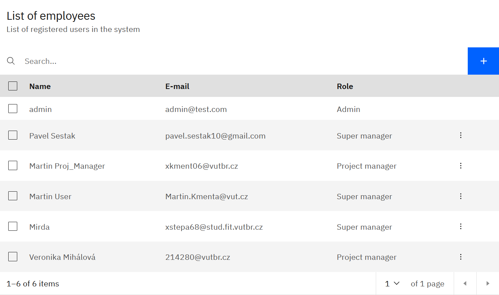
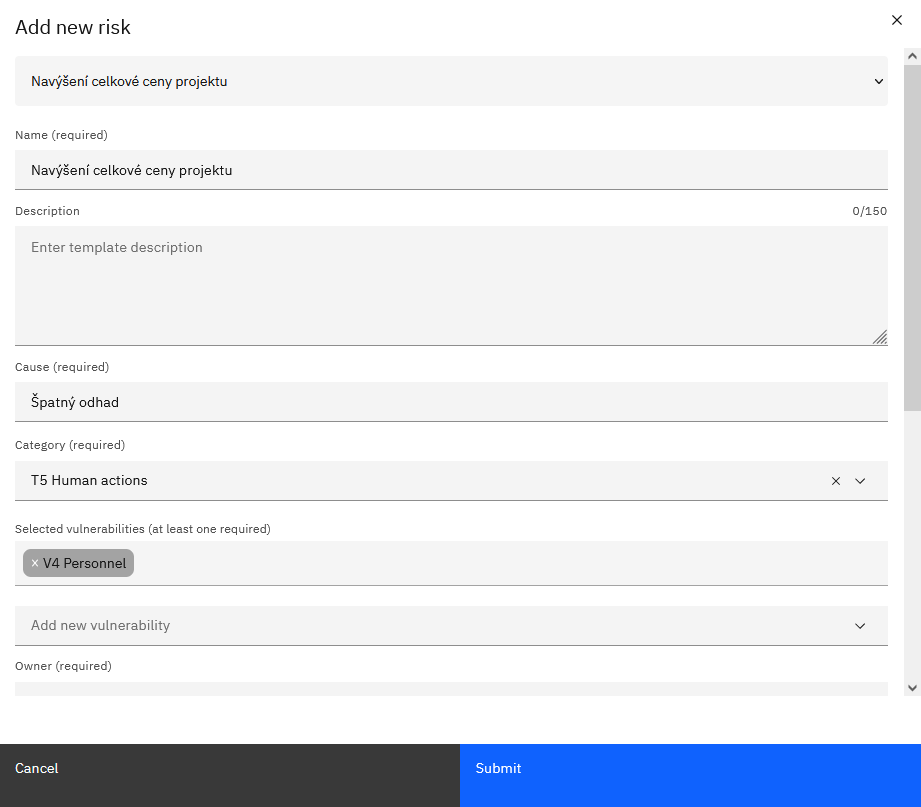
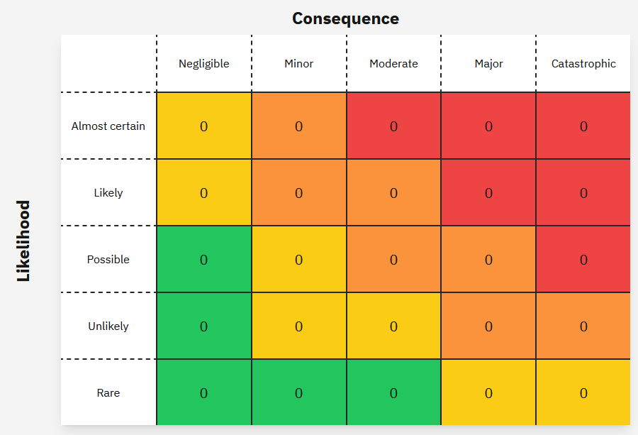
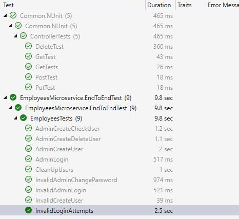
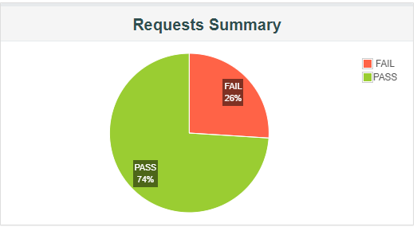
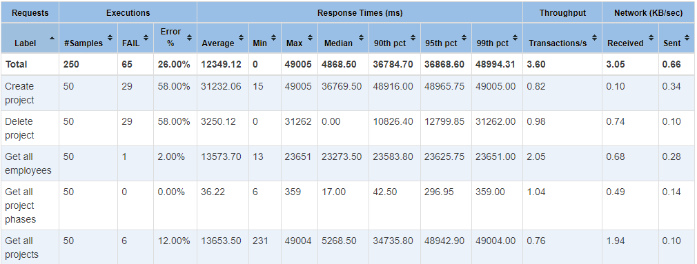
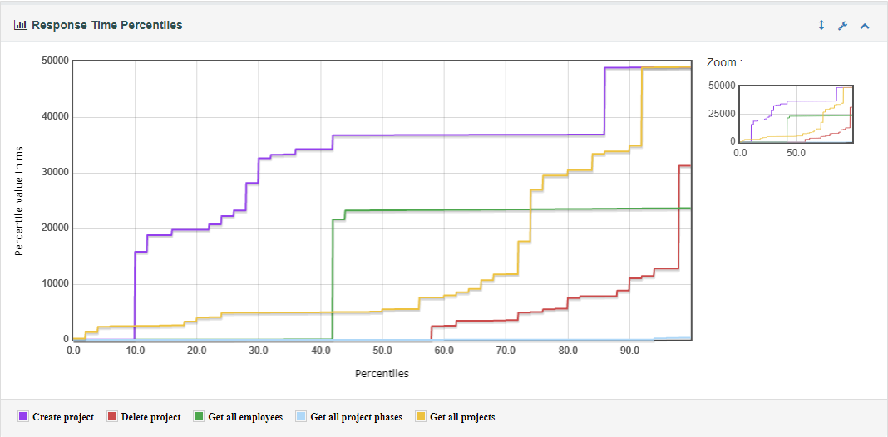
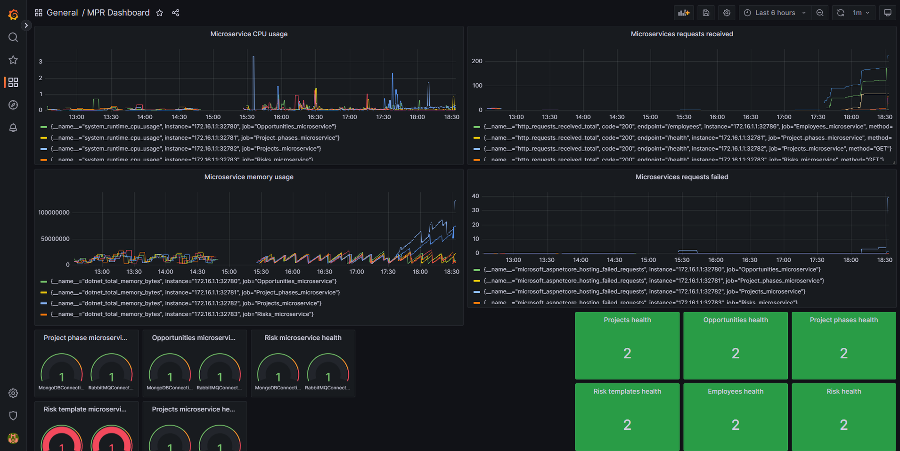

# Project-management-system-microservices
Project for the creation of project management software with an overlap into the business sphere. The application itself implemented in dotnet using microservices.

[You can preview our project presentation here](https://www.canva.com/design/DAFg85sYZbA/f3Zr4kiOrxxVRW31lleo6A/view?utm_content=DAFg85sYZbA&utm_campaign=designshare&utm_medium=link&utm_source=publishsharelink).

## UI Fragments

### Managing participants on project

### Adding new risk into project

### Result risk matrix

## Testing
### Automatatized testing

### Performance testing
Application was hosted on my home server and was connected via zerotier net. Performance testing was do via JMeter application.

### Monitoring
Microservices is hard to maintain, so we desice to monitor liveness and performce.
